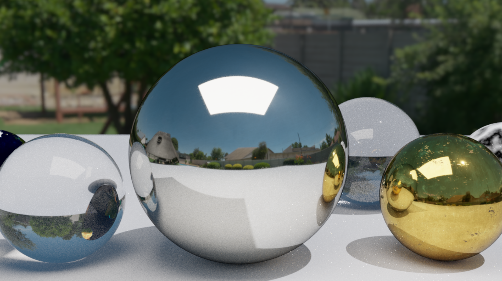

# PathTracer-CPP

`PathTracer-CPP` 是一个使用 `C++20` 编写的 CPU 路径追踪器学习项目。项目最初参考了 [Ray Tracing in One Weekend](https://raytracing.github.io/) 系列教程，并在此基础上逐步扩展出三角形网格、OBJ/MTL 资产加载、PBR 材质、GGX/VNDF 采样、IBL、MIS、体积散射与并行 tile 渲染。

仓库地址：[JiaT-T/PathTracer-CPP](https://github.com/JiaT-T/PathTracer-CPP)

## 展示图

当前 README 主展示图对应 `Renderer.cpp` 中的 `README_Showcase()` 场景：

这张图集中展示了当前渲染器已经打通的几条主能力链路：

- HDRI 环境光照与面积光混合
- `Environment_PDF + Hittable_PDF + BSDF` 的 MIS
- metallic-roughness PBR
- normal map 驱动的微表面反射
- 玻璃、传统金属、程序纹理、贴图纹理
- 常量密度体积散射
- 景深

## 当前能力

### 核心渲染能力

- 几何体：`Sphere`、`Triangle`、`Quad`、`Box`
- 加速结构：`AABB`、`BVH`
- 变换：`Translation`、`Rotate_Y`、`Scale`
- 传统材质：`Lambertian`、`Metal`、`Dielectric`、`Diffuse_Light`、`isotropic`
- 纹理：`Solid_Color`、`Checker_Texture`、`Image_Texture`、`Noise_Texture`
- 体积：`Constant_Medium`
- 相机：景深、运动模糊
- 预览：实时 PPM 预览窗口
- 并行：基于 `std::execution::par` 的 tile 分块渲染

### PBR / IBL / MIS

当前仓库已经完成一条可用的 PBR + IBL 渲染链：

- `PBR_Material`
- `Scatter + Eval + PDF` 分离式材质接口
- metallic-roughness 工作流
- `baseColor / roughness / metallic / normal` 贴图驱动
- `sRGB -> linear` 输入颜色空间处理
- Reinhard tone mapping 与 `linear -> sRGB` 输出变换
- GGX 微表面镜面项
- Schlick Fresnel
- Smith masking-shadowing
- GGX VNDF 采样
- light / BSDF MIS
- HDRI 经纬度环境贴图
- 环境贴图 importance sampling
- `Environment_PDF`
- 几何光 / 环境光自动能量估计
- 第一跳 direct-lighting 采样优化

### OBJ / 资产链路

- OBJ/MTL 自动加载
- 贴图到 `PBR_Material` 的自动映射
- 三角形 `TBN` 构建
- tangent-space normal map
- OpenGL / DirectX 法线贴图约定切换

## 代表性场景

场景入口位于 [D:\Computer Graphics\PathTracer\PathTracer-CPP\Renderer.cpp](D:/Computer%20Graphics/PathTracer/PathTracer-CPP/Renderer.cpp)，通过 `main()` 中的 `switch` 选择。

当前与 PBR / IBL 相关的主要场景：

- `14` `PBR_Test()`
  - 受控局部光源下的基础 PBR 校验
- `15` `PBR_Benchmark()`
  - 串行 / 并行 tile 渲染对比
- `16` `PBR_Normal_Map_Test()`
  - normal map 接入链路验证
- `17` `Obj_PBR_Test()`
  - `OBJ -> MTL -> Texture -> PBR_Material` 自动映射验证
- `18` `PBR_IBL_Test()`
  - HDRI + area light + MIS 回归场景
- `19` `README_Showcase()`
  - README 展示图场景

## README_Showcase()

`README_Showcase()` 不是单纯的回归测试，而是一个面向仓库展示的综合场景。

它统一使用 `PBR_IBL_Test()` 里同一套 `Sphere` 几何，并在一个镜头内组合出：

- `Metal1` 主球：展示当前最完整的 PBR + IBL 反射能力
- `Metal_Gold` 球：展示彩色金属与不同粗糙度表现
- `Dielectric` 球：展示折射 / 反射
- `Earth` 贴图球：展示图像纹理采样
- `Perlin` 球：展示程序纹理
- 传统 `Metal` 球：展示旧材质路径仍可工作
- `Constant_Medium` 雾球：展示体积材质仍然可用
- HDRI 环境 + 面积光：展示显式 direct lighting 与 environment sampling 的混合

输出文件：

- `readme_showcase.ppm`

## Benchmark

`PBR_Benchmark()` 复用 PBR 校验场景，对串行和并行 tile 渲染做对比。

测试环境：

- CPU：`Intel Core Ultra 9 275HX`
- 场景：`PBR validation`
- 分辨率：`800x450`
- 每像素采样：`400`
- 最大深度：`20`

实测结果：

- Serial：`65.3296 s`
- Parallel：`29.9941 s`
- Speedup：`2.17808x`
- Time reduced：`54.0881%`

## 构建与运行

### 环境要求

- Windows
- Visual Studio 2022
- MSVC
- C++20

### 构建方式

可直接打开以下工程文件：

- `PathTracer-CPP/PathTracer-CPP.vcxproj`
- `PathTracer-CPP/PathTracer-CPP.slnx`

推荐配置：

1. 使用 `x64`
2. `Release` 用于正式渲染
3. `Debug` 用于调试和功能验证

### 输出说明

- 渲染结果会写入 `Camera::output_filename` 指定文件
- 控制台会输出进度和总渲染时间
- 渲染过程中会弹出实时预览窗口

## 资源与纹理

图像纹理通过 `rtw_stb_image.h` 加载，常见搜索路径包括：

- 当前工作目录
- `PathTracer-CPP/images/`
- 环境变量 `RTW_IMAGES` 指定目录

OBJ 加载时会优先在模型目录内查找 `.mtl` 及其关联贴图。

当前 README 展示场景主要使用：

- `images/HDR/suburban_garden_2k.hdr`
- `images/Metal1/`
- `images/Metal_Gold/`
- `earthmap.jpg`

## 当前限制

当前版本已经具备可用的 PBR + IBL 主链，但还不是完整生产级渲染器。主要限制包括：

- 外层 `BSDF / light` choose probability 仍然是启发式，不是场景级自动估计
- Sponza 这类复杂资产还缺：
  - 更稳健的 triangulation 支持
  - alpha / cutout 材质支持
- 体积目前是常量密度 + 各向同性散射
- 更复杂的材质层尚未接入：
  - clearcoat
  - anisotropy
  - subsurface
  - sheen
- 还没有 EXR / HDR 输出链路

## 后续方向

下一阶段更值得继续推进的是：

1. 继续优化第一跳 direct-lighting 采样预算
2. 处理 normal map 的黑槽 / shadow terminator 问题
3. 为大场景资产补 triangulation 与 alpha cutout
4. 再考虑更复杂材质层与更高质量输出格式
