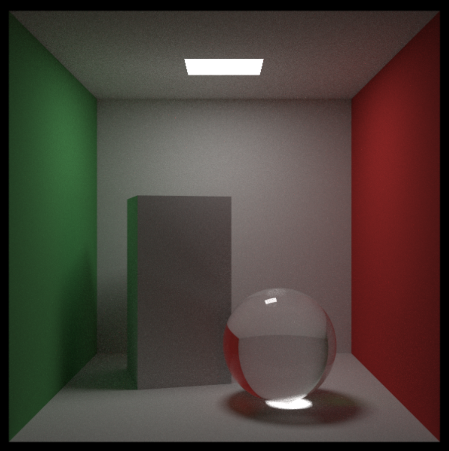
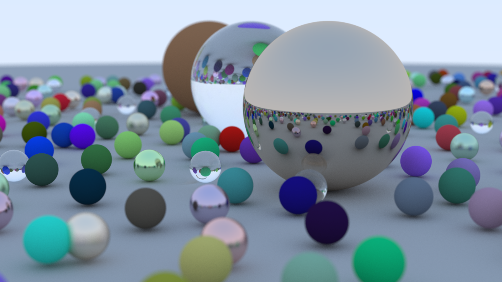

# PathTracer-CPP

一个使用 C++ 编写的路径追踪学习项目，整体实现路线参考了 Ray Tracing 系列教程，并结合仓库中的日更 Issue 持续推进功能、修复 Bug、补充数学与采样理论。

目前仓库已经不只是“能出图”的基础光线追踪器，而是逐步演进为一个包含材质系统、纹理系统、BVH、体积介质、正交基、概率密度函数与直接光照采样的现代路径追踪练习工程。

仓库地址：[JiaT-T/PathTracer-CPP](https://github.com/JiaT-T/PathTracer-CPP)

## 渲染效果

### Cornell Box



### Bouncing Spheres


## 项目特点

- 使用 C++20 编写，当前以 Visual Studio 工程为主
- 从零实现向量、颜色、射线、相机、求交、材质与纹理系统
- 支持基于蒙特卡洛积分的递归路径追踪
- 支持分层采样、重要性采样与混合 PDF
- 支持程序化纹理、图像纹理、面积光源和体积介质
- 以 GitHub Issues 记录每日实现内容、原理理解与踩坑修复

## 当前已实现能力

### 1. 几何体与空间结构

- 球体与运动球体
- 四边形 `Quad`
- 由六个四边形拼装的盒子 `Box`
- 包围盒 `AABB`
- 层次包围盒加速结构 `BVH`
- 实例平移 `Translation`
- 绕 Y 轴旋转 `Rotate_Y`
- 恒定体积介质 `Constant_Medium`

### 2. 材质系统

- 兰伯特漫反射 `Lambertian`
- 金属材质 `Metal`
- 电介质 / 玻璃材质 `Dielectric`
- 发光材质 `Diffuse_Light`
- 各向同性介质材质 `isotropic`

### 3. 纹理系统

- 纯色纹理 `Solid_Color`
- 棋盘纹理 `Checker_Texture`
- 图像纹理 `Image_Texture`
- Perlin Noise 纹理
- 基于湍流的大理石纹理

### 4. 相机与渲染能力

- PPM 图像输出
- 抗锯齿多重采样
- 分层采样 `Stratified Sampling`
- Gamma 校正
- 景深模拟
- 运动模糊
- 背景颜色控制
- 直接光照采样
- 基于 PDF 的重要性采样
- 混合 PDF `Mixture_PDF`

### 5. 采样与数学基础

- ONB 正交基变换
- 球面 UV 映射
- 余弦加权半球采样
- 球体立体角采样
- Hittable PDF
- Monte Carlo 估计与 PDF 分离式架构

## 项目结构

```text
PathTracer-CPP/
├─ docs/
│  └─ images/
│     ├─ bouncing-spheres.png
│     └─ cornell-box.png
├─ README.md
└─ PathTracer-CPP/
   ├─ Renderer.cpp            # 场景入口与主函数
   ├─ Camera.h                # 相机、采样与递归积分
   ├─ Hittable.h              # 可求交抽象、平移与旋转实例
   ├─ Hittable_List.h         # 几何集合
   ├─ Sphere.h                # 球体 / 运动球体
   ├─ Quad.h                  # 四边形与 Box 构建
   ├─ Constant_Medium.h       # 恒定体积介质
   ├─ Material.h              # 材质系统
   ├─ Texture.h               # 纹理系统
   ├─ PDF.h                   # PDF 与重要性采样
   ├─ AABB.h / BVH.h          # 包围盒与加速结构
   ├─ ONB.h                   # 正交基
   ├─ Vector3.h / Ray.h       # 数学基础
   ├─ Color.h                 # 颜色写出
   ├─ My_Common.h             # 公共常量与随机工具
   ├─ Timer.h                 # 渲染计时
   ├─ rtw_stb_image.*         # 图像纹理加载
   ├─ images/earthmap.jpg     # 示例纹理
   ├─ image.ppm               # 当前渲染输出
   └─ PathTracer-CPP.vcxproj  # Visual Studio 工程
```

## 构建与运行

### 环境要求

- Windows
- Visual Studio 2022
- MSVC 工具链
- C++20

### 推荐构建方式

当前仓库中存在可直接打开的 Visual Studio 工程：

- `PathTracer-CPP/PathTracer-CPP.vcxproj`
- `PathTracer-CPP/PathTracer-CPP.slnx`

建议步骤：

1. 使用 Visual Studio 打开 `PathTracer-CPP.slnx` 或 `PathTracer-CPP.vcxproj`
2. 选择 `x64` 平台
3. 优先使用 `Release` 配置渲染正式图像，`Debug` 更适合调试
4. 直接运行项目

### 输出结果

- 渲染结果默认写入 `PathTracer-CPP/image.ppm`
- 程序运行时会在控制台输出剩余扫描行
- 渲染完成后会输出所用时长

### 纹理文件说明

项目中的图像纹理通过 `rtw_stb_image.h` 进行搜索，支持以下方式之一：

- 直接从当前工作目录加载
- 从 `images/` 目录加载
- 通过环境变量 `RTW_IMAGES` 指定纹理目录

这意味着只要运行目录设置合理，`earthmap.jpg` 通常可以被自动找到。

## 场景入口

主入口位于 `PathTracer-CPP/Renderer.cpp`。当前通过 `main()` 中的 `switch` 选择场景：

- `1`：Bouncing Spheres
- `2`：Checker Spheres
- `3`：Earth
- `4`：Perlin Spheres
- `5`：Quads
- `6`：Lights Test
- `7`：Cornell Box
- `8`：Cornell Smoke
- `9`：Chapter Two Final Scene

如果想切换场景，直接修改 `Renderer.cpp` 中 `switch` 的 case 即可。

## 当前阶段总结

从仓库内容来看，项目已经完成了从“基础 Ray Tracing”到“具备现代重要性采样框架的路径追踪器”的一次完整跨越，尤其体现在以下几点：

- 代码结构已经从单纯的 `scatter()` 递归，过渡到“材质物理 + PDF 采样策略”解耦的设计
- 不再只依赖环境光，而是开始显式采样面积光源
- 已经支持 BVH、实例变换、体积介质等更接近真实渲染器的数据组织与场景表达
- Issues 不只是开发记录，也沉淀了大量图形学推导、数值稳定性分析和踩坑总结

## 后续可继续推进的方向

根据当前仓库内容与待办 Issue，后续适合继续扩展：

- 用 Russian Roulette 替代固定 `max_depth`
- 引入 CPU 多线程渲染
- 支持三角形与更一般的网格几何
- 扩展任意物体的体积渲染
- 进一步引入 MIS、多种光源策略或更完整的采样框架

## 说明

本项目 README 根据仓库当前源码结构与 GitHub Issues 内容整理而成，尽量保持与当前实现状态一致。如果后续场景入口、构建方式或功能模块发生变化，会同步更新本说明文档。
