# PathTracer-CPP

`PathTracer-CPP` 是一个 `C++20` 编写的 CPU 路径追踪器。项目起点是 [Ray Tracing in One Weekend](https://raytracing.github.io/) 系列，之后逐步加入了三角形网格、OBJ/MTL 加载、metallic-roughness PBR、GGX VNDF 采样、HDRI 重要性采样、NEE + MIS、体积散射、渐进式预览和降噪。

这一阶段的重点不是继续堆功能，而是**让渲染器可以证明自己是对的**：结果可以逐位复现，有数值测试和回归测试，有 Debug AOV 和可重复的 benchmark，文档中的所有数字都来自真实运行。

仓库地址：[JiaT-T/PathTracer-CPP](https://github.com/JiaT-T/PathTracer-CPP)

## 展示图

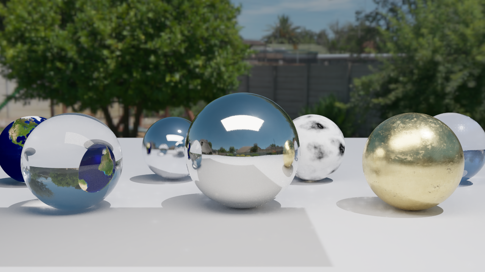

`readme_showcase`（场景 19）：1280×720，1000 spp，max depth 25，seed 1，variance-guided 降噪输出，20 线程墙钟时间约 58 s（加载 HDRI 和纹理的时间也算在内）。复现命令见[构建与运行](#构建与运行)。

图中包含：HDRI 环境光 + 单面面积光（NEE + MIS）、贴图驱动的 metallic-roughness PBR（金色球的法线贴图作用在 `Sphere` 图元上）、玻璃、传统 `Metal`、图像纹理、Perlin 纹理、玻璃壳内的常量密度体积、景深。

> 画面前景左侧较暗的矩形区域，是面积光的 quad 本身挡住 HDRI 太阳后投下的阴影：quad 是真实的几何体，上表面不发光。

<table>
<tr>
<td>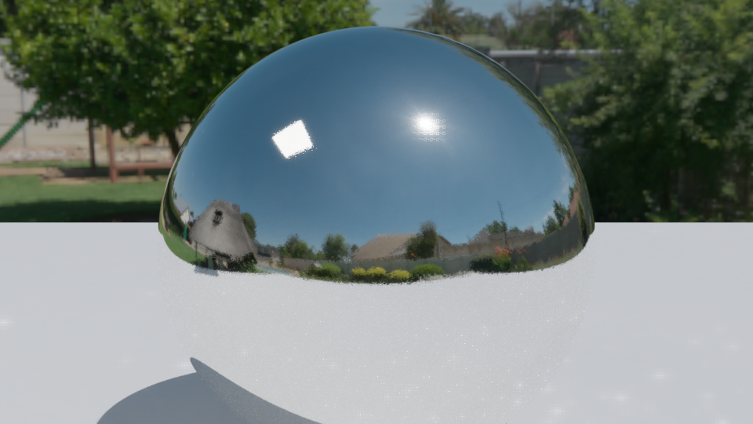<br><code>pbr_ibl_test</code>（18）</td>
<td>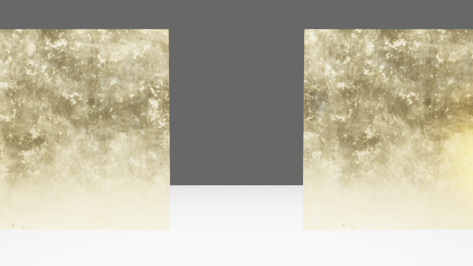<br><code>pbr_normal_map_test</code>（16）</td>
</tr>
<tr>
<td>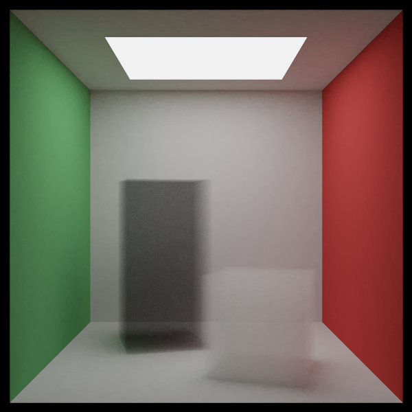<br><code>cornell_smoke</code>（8），1000 spp</td>
<td>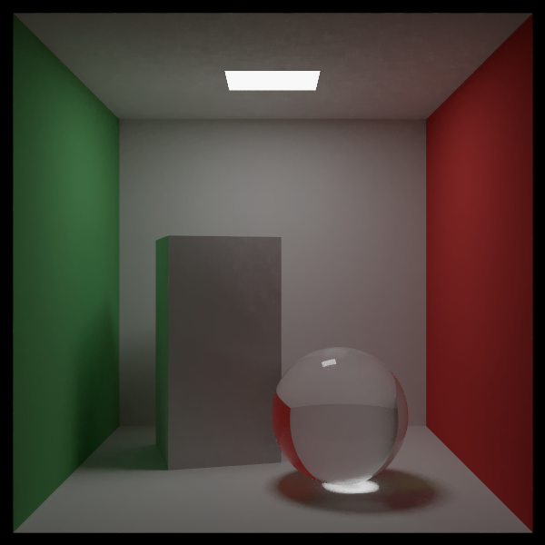<br><code>cornell_box</code>（7）</td>
</tr>
<tr>
<td>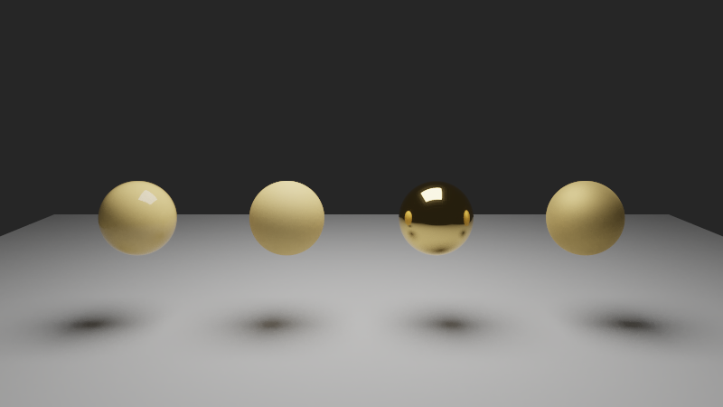<br><code>pbr_benchmark</code>（15）</td>
<td>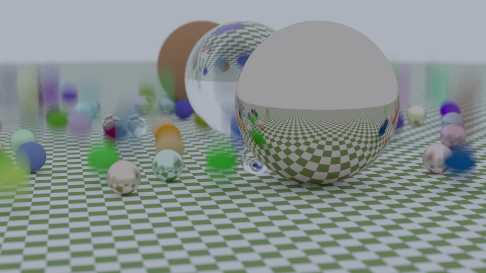<br><code>bouncing_spheres</code>（1），800 px，256 spp</td>
</tr>
</table>

所有图片都用 `tools/render_showcase.ps1` 生成，seed 固定为 1，其余参数取场景默认值（例外已在图注中标出），使用降噪输出。

## 当前功能

**几何与加速结构**
- `Sphere`（静态 / 运动模糊）、`Quad`、`Box`、`Triangle`（flat / smooth，UV，逐面切线）、`Constant_Medium`
- `Translation`、`Rotate_Y`、`Scale`；二叉 BVH（三轴 16 桶 SAH、真实叶子、按射线方向选择遍历顺序）

**材质（`Material::GetBSDF` → 栈上的 `BSDF` 值类型）**
- `Lambertian`、`Metal`（fuzz 到表面以下的方向会被吸收）、`Dielectric`、`Diffuse_Light`（单面发光）、`isotropic`（相位函数）
- `PBR_Material`：baseColor / roughness / metallic / normal 贴图，OpenGL 或 DirectX 法线约定
  - 镜面项：GGX D + **height-correlated Smith G2**，与 VNDF 采样使用同一个微表面模型（`Microfacet.h`）
  - 漫反射项：按镜面层的方向反照率做能量守恒耦合，并且满足互易性
  - lobe 选择概率与两个 lobe 的反照率成正比
- 纹理：`Solid_Color`、`Checker_Texture`、`Image_Texture`（sRGB 或 Linear，只解码一次）、`Noise_Texture`

**光照与积分器（`Integrator.h`）**
- 迭代式 `PathIntegrator`，显式维护 throughput
- NEE + BSDF 采样，使用多样本 power heuristic；第一个顶点做 4 次光源采样，之后每个顶点 1 次
- 光源选择（`LightSampler.h`）：几何光源和环境光按“辐亮度 × 立体角”估计重要性，在每个着色点计算选择概率
- 经纬度 HDRI，2D CDF 重要性采样
- 基于 throughput 的 Russian roulette
- 体积：常量密度，各向同性相位函数，体积散射点同样做 NEE

**工程**
- 确定性渲染：固定 seed 时，任何线程数下都得到逐位相同的图像
- 输出：tonemap 后的 PPM，另外输出线性 HDR 的 PFM（降噪版本单独一份），可选 Debug AOV
- CLI：场景选择、spp、分辨率、depth、seed、线程数、AOV、降噪模式
- 测试：`--test`（数值与 BVH 检查）、`--test bvh`、`--regress`（7 个固定 seed 的场景）、`--bench`、`--denoise-eval`
- 渐进式预览窗口（Win32）

## 渲染管线

```
CLI (Renderer.cpp) → scene_registry() → SceneDesc{world, lights, camera}
→ Camera: 8×8 tiles × pixels × samples（parallel_for，线程数可指定）
    rng::begin_pixel_sample(seed, pixel, sample)
    ray = get_ray(i, j, s)          分层 + 按像素打乱顺序的子像素抖动、景深、时间
    L = PathIntegrator::Li(ray)     NEE + MIS + RR，同时记录 AOV / guide
→ 线性 framebuffer → variance-guided A-Trous 降噪
→ PFM（线性）/ PPM（Reinhard + sRGB）/ AOV 的 PFM + PPM
```

模块关系见 [`docs/architecture.md`](docs/architecture.md)。

### NEE 与 MIS

在每个非 delta 顶点：
- 光源策略：从光源混合分布采样 `N_L` 个方向，权重 `w_L = (N_L p_L)² / ((N_L p_L)² + p_B²)`，每个方向发一条阴影射线（取最近交点的 emission）；
- BSDF 策略：采样一个方向，这条射线同时也是路径的延续。它命中发光体（或射入环境光）时，贡献乘以 `w_B = p_B² / ((N_L p_L)² + p_B²)`。

相机射线和 delta 事件之后遇到的 emission 权重为 1。场景没有光源列表时，光源策略为空，所有权重都退化为 1。

### 光源选择

`p_L(ω) = Σ_i P_i(x) · p_i(ω)`。每个策略的重要性估计如下：

| 策略 | 估计值 |
|---|---|
| 面积光（Quad / Triangle） | `L · min(2π, A·|cos θ_l| / d²)`；从背面看单面光源时为 0 |
| 球形光源 | `L · 2π(1 − cos θ_max)` |
| 环境光 | `½ ∫ L dω`（与贴图分辨率无关；体积散射点使用完整积分） |

最终概率为 `P = 0.9 · 估计值归一化 + 0.1 · 在可能有贡献的策略间均匀分配`。旧版本把环境贴图的**像素求和**与面积光的 `L·A` 直接比较（两者量纲不同），展示场景中的面积光因此一直被 clamp 在 5%；现在是 56%（在相机注视点处，通过 CLI 输出查看）。

### GGX / VNDF / Smith

- 采样：Heitz 2018 VNDF，`pdf(l) = G1(v) D(h) / (4 n·v)`；反射到地平线以下的样本直接判为无效（pdf = 0），**不会**替换成法线方向。
- 求值：`D · G2 · F / (4 n·v n·l)`，其中 `G2 = 1 / (1 + Λ(v) + Λ(l))`。
- roughness 下限为 0.05。

## 确定性渲染

每个像素样本都有一条独立的 PCG32 随机流，种子由 `hash(seed, pixel_index, sample_index)` 得到；每个像素只由一个线程按样本顺序累加。因此只要 seed、场景、分辨率、spp 和 depth 相同，1 个、3 个或全部线程的结果都逐位相同（`--test determinism` 会检查这一点）。场景构建（随机布局、Perlin 置换表）使用同一个 seed。

不指定 `--seed` 时会随机取一个 seed，并打印在日志中，方便事后复现。

## 输出格式

| 文件 | 内容 |
|---|---|
| `<out>.ppm` | 显示用图像：逐通道 Reinhard → sRGB → 8 bit；默认使用降噪结果 |
| `<out>_raw.ppm` | `--output-mode both` 时额外写出的未降噪图像 |
| `<out>.pfm` | **线性 HDR、未降噪**的估计值，用于数值比较 |
| `<out>_denoised.pfm` | 线性 HDR 的降噪结果 |
| `<out>_<aov>.pfm` / `.ppm` | Debug AOV（线性值，以及可视化图） |

`tools/imgtool.py`（只依赖 Python 标准库）可以把 PFM/PPM 转成 PNG，也能拼图、裁剪、做差分图，以及计算 RMSE / relMSE。

## Debug AOV

`--aov normal,depth` 或 `--aov all`：

`beauty`、`albedo`、`normal`（BSDF 实际使用的 shading normal）、`geo_normal`、`depth`、`roughness`、`metallic`、`emission` / `direct` / `indirect`（按到达发光体之前的散射次数划分：0 / 1 / ≥2 次，三者之和等于 beauty）、`samples`、`bsdf_pdf`、`light_pdf`、`mis_weight`（第一个顶点）、`path_length`、`variance`（像素均值的方差）。

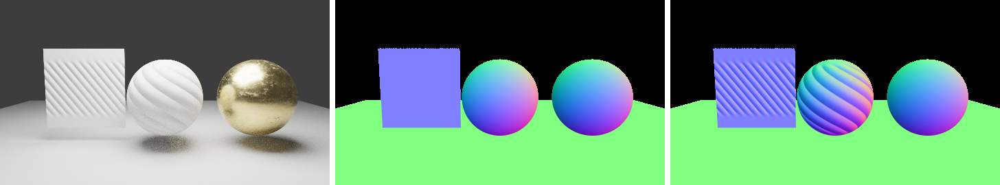

`normal_map_small`：beauty / geometry normal / shading normal。三角形面板和中间的 `Sphere` 都采用了法线贴图。

## 降噪

`PostProcess.h`，SVGF 风格的空间 A-Trous（只用了空间部分，因为离线渲染没有时间维度的历史帧）：

- guide（albedo / normal / depth）与颜色使用同一批样本累加（包含抖动、景深、运动模糊），并且取自**第一个非 delta 顶点**，所以镜面和玻璃里反射、折射出的内容也有 guide；
- 亮度边缘停止项按 `sqrt(Var_p + Var_q)` 缩放（对称），方差按权重的平方一起滤波；方差低（已经收敛）的像素几乎不会被改动；
- 保守的 albedo demodulation：albedo 设下限 0.02，没有 guide 的像素原样保留；
- 直接可见的发光体既不参与滤波，也不作为邻居；glossy 像素降低滤波强度。

`--denoise-eval` 的结果（relMSE 相对 64× spp 的参考图，越低越好）：

| 场景 | 16 spp：raw / 旧滤波器 / 新滤波器 | 64 spp：raw / 旧滤波器 / 新滤波器 |
|---|---|---|
| cornell_small | 0.1361 / 0.1306 / **0.0226** | 0.0259 / 0.0216 / **0.0053** |
| normal_map_small | 0.0314 / 0.0265 / **0.0173** | 0.0109 / 0.0095 / **0.0058** |
| environment_small | 0.7126 / 0.7047 / **0.0625** | 0.0748 / 0.0824 / **0.0537** |
| volume_small | 0.0077 / 0.0040 / **0.0027** | 0.0018 / 0.0009 / **0.0008** |

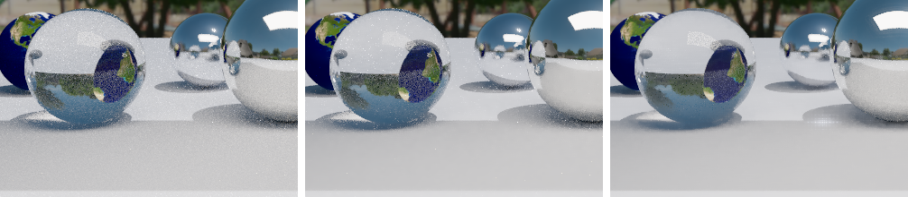

`readme_showcase`，64 spp：raw / 旧滤波器 / variance-guided。spp 很低时，大面积平坦区域仍会出现 A-Trous 特有的斑块。

## 测试与回归

```powershell
cd PathTracer-CPP
x64\Release\PathTracer-CPP.exe --test          # 全部数值与渲染检查
x64\Release\PathTracer-CPP.exe --test bvh      # 求交一致性、退化输入、介质与线程确定性
x64\Release\PathTracer-CPP.exe --regress       # 7 个场景，约 1 s（参考图生成约 20 s）
```

`--test` 覆盖的内容：
- **PDF 归一化 + χ² 检验**：cosine、sphere、GGX VNDF（积分 = 1 − P(无效样本)）、完整 PBR 混合分布、环境贴图（确定性积分 1.000000）、面积光和球形光源（E[1/pdf] = 立体角）、光源选择混合分布；
- **白炉测试**：Lambert = 1；白色电介质 PBR = 1 ± 1%；白色金属与精确的 height-correlated Smith 单次散射参考值一致；相位函数反照率；
- BRDF 互易性；采样得到的 pdf 与单独求值的 pdf 一致；纹理解码（128 → 线性 0.502 / sRGB 0.216）；
- 渲染：多线程确定性；开启和关闭 Russian roulette 时均值一致；每条相机路径的堆分配次数为 0；emission + direct + indirect = beauty；法线贴图在三角形和 `Sphere` 上都生效；降噪降低 relMSE 且保持均值不变。
- BVH：固定射线与线性遍历的最近命中及主要命中属性一致；空树、单图元、退化中心、平行射线、零厚度盒和区间端点；同距离命中按原输入顺序选择材质；单介质叶的随机数状态及散射概率；BVH 体积场景跨线程逐位一致。

`--regress` 使用固定 seed 渲染 `furnace_lambert` / `furnace_volume`（解析值为 1）、`furnace_pbr`、`cornell_small`、`volume_small`、`normal_map_small`、`environment_small`，与 `tests/reference/*.pfm`（1024 spp）比较 relMSE 和图像均值。有意改动渲染结果时，用 `--regress --update-references` 更新参考图。

白炉测试（白色 base，确定性求积，r = roughness）：

| | Karis `k=(r+1)²/8`（旧） | 精确 Smith G2（新） | 参考值 |
|---|---|---|---|
| 金属 r=0.05，cos θv=0.1 | 0.199 | 1.000 | 1.000 |
| 金属 r=0.25，cos θv=0.1 | 0.196 | 0.897 | 0.897 |
| 金属 r=0.5，cos θv=1 | 0.860 | 0.916 | 0.916 |
| 电介质 r=0.05，cos θv=0.1 | 1.060（增能） | 0.999 | 1 |

粗糙金属剩余的能量损失（例如 r=1 正入射时为 0.31）是单次散射 GGX 固有的，目前还没有做多次散射补偿。

## Benchmark

### Native SAH 对照（2026-10-02）

基线为 `3769026`，对照本次三轴 16 桶 SAH、真实叶子和方向遍历的完整改动。同机 Release x64、MSVC 19.38、Core Ultra 7 265KF，seed 1、宽 400、64 spp、场景默认深度；teapot 为 400×400，另两场景为 400×225。两个版本使用同一临时驱动，分别链接各自的场景实现；先预热 GGX 表和一次 20 线程渲染，再在 1 / 20 线程各测 5 次。只计 `Camera::Render`，不含构建、预览、降噪、哈希和文件输出。

下表单位为毫秒，格式是 **中位数 [最小值, 最大值]**：

| 场景 | 线程 | 基线 | SAH | 中位耗时变化 |
|---|---:|---:|---:|---:|
| teapot | 1 | 4782.5 [4736.5, 4835.6] | 3548.8 [3536.2, 3663.1] | -25.8% |
| teapot | 20 | 325.3 [308.7, 363.3] | 298.3 [258.7, 317.0] | -8.3% |
| pbr_benchmark | 1 | 2153.2 [2152.2, 2172.3] | 2251.6 [2196.3, 2446.9] | +4.6% |
| pbr_benchmark | 20 | 151.0 [145.6, 153.6] | 152.4 [146.2, 157.0] | +0.9% |
| readme_showcase | 1 | 6635.0 [6525.4, 6722.7] | 6455.1 [6383.6, 6647.6] | -2.7% |
| readme_showcase | 20 | 416.2 [394.4, 421.3] | 396.3 [385.7, 411.7] | -4.8% |

teapot 每条射线的节点访问从 23.068 降至 14.971，图元测试从 3.913 降至 1.804，分别减少 35.1% 和 53.9%。PBR / 展示场景的节点访问反而增加约 5%，虽然图元测试减少，但耗时收益有限；本次 PBR 单线程还有小幅回退，不能据此宣称所有场景都加速。20 线程短任务的波动较大，上述结果是这次测量的分布。

三个场景在两版本、两种线程数和所有重复轮次中的原始 double 像素哈希均一致，输出 PFM 的 SHA-256 也一致。单次场景加载及构建耗时为：teapot 10.83 → 12.70 ms，PBR 0.050 → 0.060 ms，展示场景 394.25 → 389.31 ms；其中包含 OBJ / 纹理加载，不能当作纯 BVH 构建基准。

可用内置基准复查渲染耗时与计数器（在两个版本分别执行，并替换场景名）：

```powershell
x64\Release\PathTracer-CPP.exe --bench --scene teapot --width 400 --spp 64 --seed 1 --threads-list 20,1,1,1,1,1,20,20,20,20,20 --repeat 1
```

首行 20 线程作为预热，余下各组取 5 次的中位数及范围；内置 `--repeat 5` 报告最快值，不等同于这里的中位数。

### SAH 改造前的线程扩展记录

以下保留 SAH 改造前（`3769026`）的历史基准。`--bench`：`pbr_benchmark`，800×450，400 spp，max depth 20，seed 1，Release x64，MSVC 19.38（v143），Intel Core Ultra 7 265KF（20 线程，8P + 12E），每项跑 1 次。`--bench` 计时不包含场景构建、预览、降噪和输出。

| 版本 | 1 线程 | 20 线程 | 加速比 |
|---|---:|---:|---:|
| 原始代码 + Audit 修复（`74c3601`，旧的 `PBR_Benchmark()`，`std::execution::par`） | 98.33 s | 47.19 s | 2.08× |
| 积分器重构前（`2a80474`，新的 harness） | 74.66 s | 46.77 s | 1.60× |
| **积分器重构后、SAH 改造前** | **54.73 s** | **3.42 s** | **16.01×** |

同一历史版本的线程扩展：

| 线程 | 时间 (s) | MRays/s | 加速比 | 效率 |
|---:|---:|---:|---:|---:|
| 1 | 54.731 | 9.16 | 1.00× | 100.0% |
| 2 | 27.562 | 18.18 | 1.99× | 99.3% |
| 4 | 14.394 | 34.82 | 3.80× | 95.1% |
| 8 | 7.794 | 64.30 | 7.02× | 87.8% |
| 16 | 4.108 | 122.00 | 13.32× | 83.3% |
| 20 | 3.420 | 146.55 | 16.01× | 80.0% |

以上历史基准中，每条相机路径：1 条主射线 + 0.558 条延续射线 + 1.922 条阴影射线；每条射线平均访问 5.36 个 BVH 节点、测试 2.92 个图元；渲染过程中的堆分配共 22 次（缓冲区和线程），相当于每条路径 0 次。

扩展性的主要改善来自两处：去掉热路径上的 `make_shared`（每次反弹 2–6 次），以及把 `HitRecord::mat` 从 `shared_ptr` 改为裸指针（此前每次图元命中都会对同一个控制块做原子增减，所有线程在这里竞争）。另外，延续射线兼做 BSDF 的 MIS 样本，每次反弹少追踪一条射线。旧 README 中的 `65.3 s / 30.0 s / 2.18×` 是在另一台机器（Core Ultra 9 275HX）上测得的，而且当时这个场景的面积光朝向是反的（Audit F7），与这里的数字不能直接比较。

## 修复前后对比

| 对比 | 图 |
|---|---|
| 展示场景：原始代码（`6208633`，上）/ 当前（下），640×360，256 spp，未降噪 | 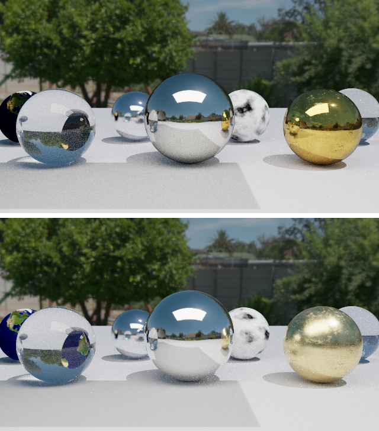 |
| 局部：原始代码中法线贴图在 `Sphere` 上无效、金属使用 Karis G、纹理被 gamma 解码两次；当前版本已修复 | 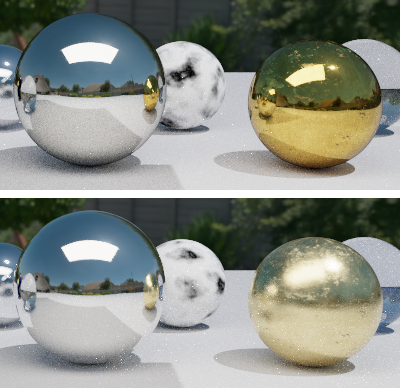 |
| 体积：原始代码的相位函数 PDF 大了 4 倍并额外乘了 cos，体积只保留约 1/16 的能量（左，961 spp，渲染 382 s）；当前（右，1000 spp，渲染 19 s） | 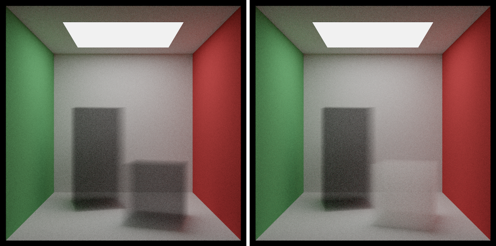 |
| 均匀环境光下的白炉：Karis G（上）/ 精确 Smith（下）。第一行是 roughness 0.05–1 的金属，第二行是电介质；能量守恒时球与背景融为一体 | 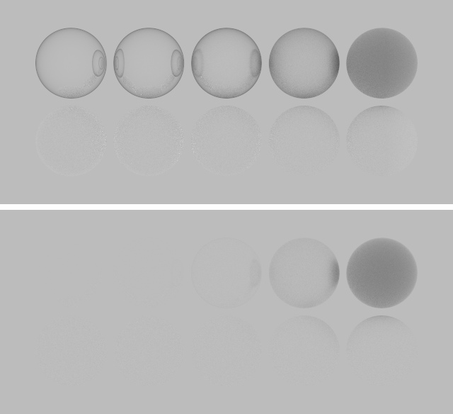 |
| 光源选择，64 spp：旧权重（面积光 5%，上）/ 新权重（56%，下）。此区域的 relMSE（剔除 0.1% 的离群值）从 0.035 降到 0.0073 | 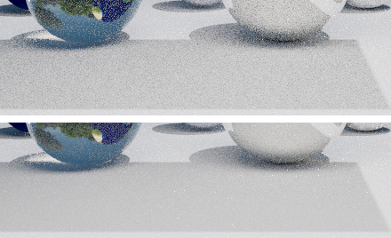 |

## 构建与运行

### 环境

- Windows（预览窗口依赖 Win32）
- Visual Studio 2022 或更新版本（MSVC，C++20）；工程文件使用 `$(DefaultPlatformToolset)`，VS 2022 下为 v143，VS 2026 下为 v145
- 可选：CMake ≥ 3.20；Python 3（仅 `tools/imgtool.py` 需要）

### 构建

```powershell
powershell -ExecutionPolicy Bypass -File tools/build.ps1        # Release x64，使用 vswhere 查找 MSBuild
# 或直接打开 PathTracer-CPP/PathTracer-CPP.slnx / .vcxproj
# 或使用 CMake（仓库根目录；PathTracer-CPP/CMakeLists.txt 也会转发到根目录）：
cmake -S . -B build/cmake -G "Visual Studio 17 2022" -A x64
cmake --build build/cmake --config Release
ctest --test-dir build/cmake -C Release --output-on-failure   # 运行 --test 与 --regress
```

CMake 生成的可执行文件是 `build/cmake/Release/PathTracer.exe`，用法与下面的 `x64\Release\PathTracer-CPP.exe` 完全相同。

### 运行

所有命令都在 `PathTracer-CPP/` 目录下执行（纹理按相对路径加载）：

```powershell
x64\Release\PathTracer-CPP.exe --list                                   # 列出场景
x64\Release\PathTracer-CPP.exe --scene readme_showcase --seed 1 --no-preview --output-mode both --out output/readme_showcase.ppm
x64\Release\PathTracer-CPP.exe --scene cornell_box --spp 64 --width 300 --seed 5 --aov normal,direct,variance
x64\Release\PathTracer-CPP.exe --bench --scene pbr_benchmark --threads-list 1,2,4,8,16,20
x64\Release\PathTracer-CPP.exe --denoise-eval --spp 16
x64\Release\PathTracer-CPP.exe --help
```

重新生成本 README 中的所有图片：`powershell -ExecutionPolicy Bypass -File tools/render_showcase.ps1`，然后运行 `python tools/imgtool.py topng ...`。

## 场景

场景定义在 [`PathTracer-CPP/Scenes.cpp`](PathTracer-CPP/Scenes.cpp)，可以用名字或编号选择：

| # | 名称 | 内容 |
|---|---|---|
| 1–6 | `bouncing_spheres`、`checker_spheres`、`earth`、`perlin_spheres`、`quads`、`lights_test` | RTIOW 系列场景（没有光源列表，纯 BSDF 路径追踪） |
| 7 / 8 | `cornell_box` / `cornell_smoke` | Cornell box（NEE）/ 两个常量密度体积 |
| 9 | `chapter_two_final` | RTTNW 最终场景 |
| 10 | `triangle_test` | 三角形面积光 |
| 11 / 13 / 14 | `obj_test` / `sponza` / `pbr_test` | 需要 `Model/dragon.obj`、`Model/sponza.obj`、`Model/sphere.obj`，**这些文件不在仓库中** |
| 12 | `teapot` | `Model/teapot.obj` |
| 15 | `pbr_benchmark` | roughness × metallic 矩阵（benchmark 场景） |
| 16 | `pbr_normal_map_test` | 有 / 无法线贴图的面板对比 |
| 17 | `obj_pbr_test` | OBJ/MTL → `PBR_Material` 自动映射 |
| 18 | `pbr_ibl_test` | HDRI + 面积光 + 带贴图的 PBR 球 |
| 19 | `readme_showcase` | README 展示图 |
| 100–106 | `furnace_*`、`*_small` | 测试 / 回归场景 |

纹理资产的审查记录见 [`ASSET_REVIEW.md`](ASSET_REVIEW.md)，其中包括 `Metal049A_Roughness.jpg` 为何接近全黑。

## 当前限制

- BVH 已采用分桶 SAH，但仍是递归指针树，没有扁平化；三角形作为单独的堆对象存储。按分割轴方向选择子树只是近侧启发式，未按实际包围盒入口距离排序。
- 三角形求交会把 `p` 沿面法线偏移 0.001（绝对值，与场景尺度无关），用三角网格建模的玻璃会自相交。
- 法线贴图：切线按面计算，没有 handedness，没有 shadow terminator 处理；OBJ 中的 `map_bump`（高度图）会被当作法线贴图，UV 被 clamp，`map_d` 被忽略。
- GGX 只有单次散射（粗糙金属偏暗），没有粗糙透射；`Dielectric` 从光密介质射出时，Schlick 使用的是入射角。
- 体积：只有常量密度和各向同性相位函数；展示场景中的雾球被玻璃外壳包住，NEE 会被外壳挡住。
- 逐通道 Reinhard，没有曝光参数，没有 EXR 输出。
- 降噪器在极低 spp 下会出现斑块；镜面反射中的细节只能靠 glossiness 启发式来保护。
- 预览窗口不能切换 AOV；没有单像素路径日志（`--debug-pixel`）。

## 文档

- [`docs/architecture.md`](docs/architecture.md)：模块关系和测试保护的不变量
- [`PATH_TRACER_IMPROVEMENT_AUDIT.md`](PATH_TRACER_IMPROVEMENT_AUDIT.md)：技术审查报告
- [`PATH_TRACER_IMPLEMENTATION_REPORT.md`](PATH_TRACER_IMPLEMENTATION_REPORT.md)：本阶段的实现报告
- [`ASSET_REVIEW.md`](ASSET_REVIEW.md)：纹理资产审查
- [`ASSETS.md`](ASSETS.md)：第三方代码与资源的来源及待确认的许可

## 参考与资源许可

- 起点：[Ray Tracing in One Weekend](https://raytracing.github.io/) 教程系列。
- OBJ 解析：[tinyobjloader](https://github.com/tinyobjloader/tinyobjloader)，许可证保留在 vendored header 中；图像加载：[stb](https://github.com/nothings/stb)，header 中保留了 MIT / public-domain 条款。
- 仓库 LICENSE 不能替代第三方资源的原始许可，详见 [`ASSETS.md`](ASSETS.md)。
